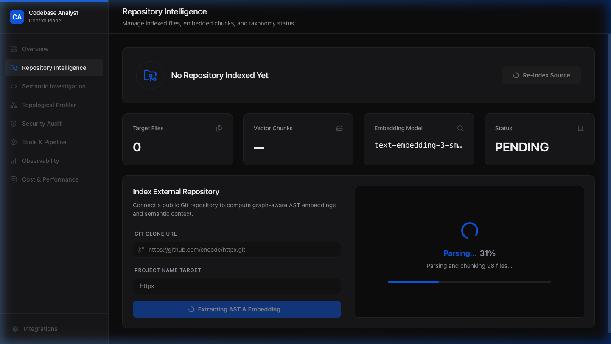
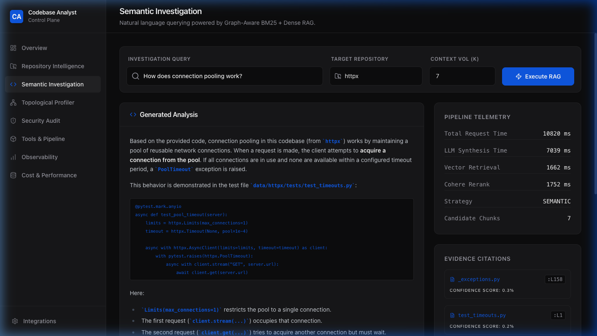

# Production RAG Code Intelligence System

*Deployed Application:* [Codebase Analyst](https://production-rag-code-intelligence-sy-ebon.vercel.app/)

An enterprise-grade, AI-powered codebase analysis platform designed with a focus on **Systemic Engineering**. We prioritize building a stable, scalable, and memory-efficient software architecture around advanced AI models, rather than just developing models in isolation.

## The Demo: Indexing encode/httpx

To experience the platform's capabilities without waiting for massive repositories to process, we recommend using the popular Python HTTP client `httpx` for your initial demonstration.

1. Navigate to the deployed frontend.
2. Enter the repository URL: `https://github.com/encode/httpx.git`
3. Click "Ingest Repository". The system will seamlessly stream the AST parsing, chunking, and embedding progress in real-time.



Once the ingestion is complete, you can begin exploring. Try asking architectural questions such as "How does the AsyncClient handle connection pooling?" or "Where are the retry mechanisms implemented?".



The application also provides comprehensive telemetry and system status monitoring.


## Architectural Philosophy

This system translates a critical business need—developer onboarding and deep code comprehension—into a resilient, scalable technical architecture. It was built focusing on several core engineering pillars.

### 1. Systemic Engineering and High-Performance Pipelines

We focus on building stable, high-throughput software around advanced AI models.

*   **Flat-Memory Streaming Pipeline:** The ingestion engine bypasses traditional batch processing bottlenecks. By utilizing a highly optimized generator, it parses, chunks, embeds, and flushes one file at a time. This guarantees linear memory scaling and allows the system to effortlessly ingest massive, enterprise-scale 10,000+ file repositories without locking up resources.
*   **Zero-Footprint Embeddings:** Heavy local ML dependencies are stripped entirely. Instead, the architecture streams semantic batches to OpenAI's lightweight `text-embedding-3-small` API, enabling lightning-fast vectorization and minimizing container footprint.

### 2. Data Intuition

Understanding how to structure and curate data to maximize LLM retrieval performance is critical.

*   **AST-Aware Chunking (Tree-sitter):** Simple line-splitting destroys code context. This system leverages `tree-sitter` to parse the language's Abstract Syntax Tree (AST), ensuring code chunks are intelligently broken down precisely at logical function and class boundaries.
*   **Hybrid Search Engine:** The system combines dense semantic vector similarity (Qdrant) with precise lexical matching (BM25/TF-IDF) to ensure both conceptual questions and exact variable or function-name lookups return perfectly grounded citations.

### 3. Architectural Foresight

Designing systems that adapt to changing requirements, gracefully degrade, and support enterprise scaling.

*   **Multi-Tenant Vector Isolation:** Qdrant collections are dynamically namespaced per repository. This zero-contamination design ensures clean context retrieval across multiple simultaneous projects.
*   **Silent Fallbacks and Resilience:** If Redis caching fails, the system seamlessly bypasses it. If secondary API rate limits (like Cohere reranking) are hit, it falls back to raw hybrid retrieval. The application sustains functionality as long as the core LLM is reachable.

### 4. Validation Rigor and Technical Agility

*   **Dynamic Query Routing:** User queries are classified in real-time by the LLM into categories like `symbol_lookup`, `architecture_question`, or `semantic_search`, triggering the optimal retrieval strategy.
*   **Comprehensive Observability:** Built-in Prometheus metrics track critical performance indicators like embedding latency, semantic cache hit rates, and retrieval confidence scores.

## System Architecture

```text
┌─────────────┐     ┌────────────────┐     ┌─────────────┐
│  React UI   │────▶│ FastAPI Backend│────▶│ OpenAI APIs │
│  (Vercel)   │     │ (Render)       │     │ (Embed/LLM) │
└─────────────┘     └────────────────┘     └─────────────┘
                            │
          ┌─────────────────┼──────────────────┐
          ▼                 ▼                  ▼
  ┌──────────────┐   ┌──────────────┐   ┌──────────────┐
  │ Qdrant Cloud │   │ Upstash Redis│   │ Tree-sitter  │
  │ (Vector DB)  │   │ (Caching)    │   │ (AST Parser) │
  └──────────────┘   └──────────────┘   └──────────────┘
```

## Local Development Setup

### 1. Environment Configuration

```bash
cp .env.example .env
# Required Variables:
# OPENAI_API_KEY=sk-...
# QDRANT_URL=...
# REDIS_URL=...
```

### 2. Run the Backend API

```bash
pip install -r requirements.txt
uvicorn main:app --reload --port 8000
```

### 3. Run the Frontend Client

```bash
cd frontend
npm install
npm run dev
```

## Core Components Overview

*   **`codebase_analyst/ingestion/`**: Contains the memory-safe `processor.py` for downloading and scanning repositories, and `chunker.py` for semantic AST-based splitting boundaries.
*   **`codebase_analyst/indexing/`**: Manages the connection to OpenAI for generating embeddings and Qdrant for storing the vectors (`embedding.py`, `vector_store.py`).
*   **`codebase_analyst/retrieval/`**: Houses the Hybrid Search engine, fusing Dense (cosine similarity) and Sparse (keyword) metrics.
